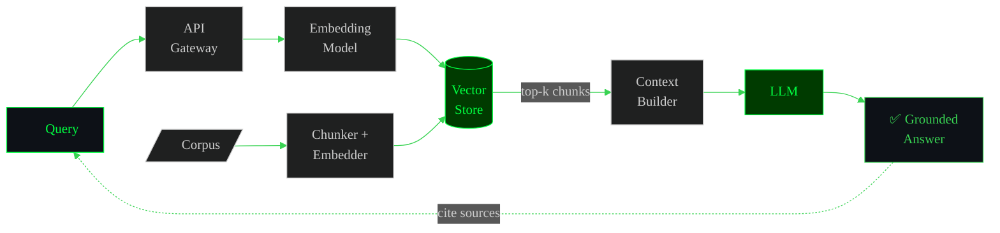
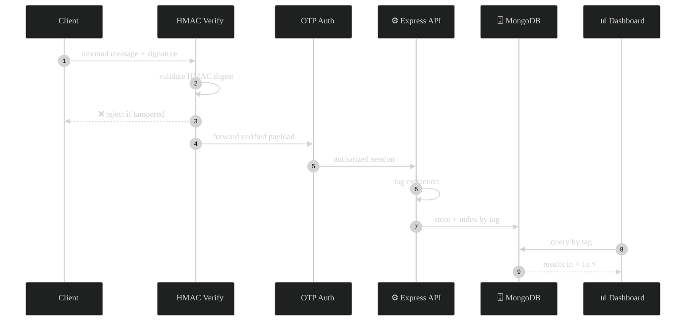
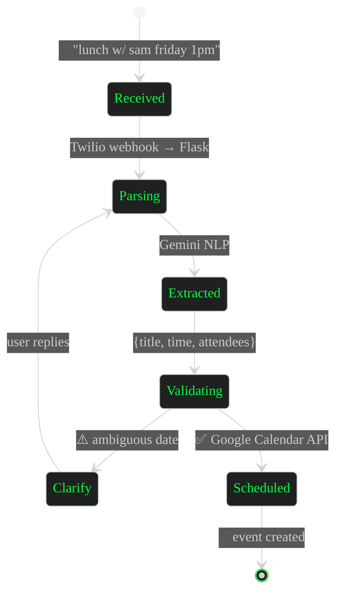

<div align="center">


```
╻ ╻ ╻ ┏┓ ┏━┓ ╻ ╻   ╻ ╻ ┏━┓
┃┏┛ ┃ ┃┃ ┣━┫ ┗┳┛   ┃┏┛ ┗━┓
┗┛  ╹ ┗┛ ╹ ╹  ╹    ┗┛  ┗━┛
```


</div>

<div align="center">

```bash
root@vijay:~$ sudo ./boot.sh --verbose

[ OK ]  wake up, neo ......................... done
[ OK ]  loading identity module .............. done
[ OK ]  mounting /dev/curiosity .............. done
[ OK ]  starting backend daemons ............. done
[ OK ]  spawning retrieval pipeline .......... done
[ OK ]  injecting caffeine into bloodstream .. done
[WARN]  sleep schedule ...................... not found

> user      : Vijay
> role      : AI Engineer Intern @ Tecdia
> stack     : backend · retrieval · distributed systems
> uptime    : always shipping, occasionally sleeping
> matrix    : there is no spoon. only edge cases.
> _
```

</div>

<div align="center">

[](https://git.io/typing-svg)

<br>

[](https://drive.google.com/file/d/1cTLbskZDVTtZIVK_c6CGWRfneKLqH_Je/view?usp=drive_link)
[](https://linkedin.com/in/vijay-vs-103389271)
[](mailto:vijay080504@gmail.com)

</div>

<br>

<div align="center">

> ` I build. I break things. I trace the stack. I build again. `
>
> ` backend logic by day, retrieval pipelines by night, `
> ` computer vision when the problem gets interesting. `
>
> **`< stay curious, ship relentlessly />`**

</div>


## `~/whoami $ cat roles.log`

```diff
+ AI Engineer Intern       @ Tecdia         — Apr 2026 – Present
+ Software Engineer Intern @ Globally Gi    — Jan 2026 – Mar 2026
! currently                                 — deep in distributed systems & DB internals
```


## `~/whoami $ ls -la stack/`

<div align="center">

[](https://skillicons.dev)

</div>


## `~/whoami $ cat interests.md`

### `>` How I think about retrieval

> A reference architecture I use as my mental model for RAG systems — the general
> shape most retrieval pipelines converge on, regardless of the specific stack.




## `~/whoami $ git log --projects`

### `[01]` [TagVault](https://github.com/Vijayxx/Message-Tagging) — `TypeScript` `Node.js` `MongoDB`

> Secure message ingestion with HMAC + OTP auth, and a tag-indexed dashboard for sub-second retrieval.



---

### `[02]` [WhatsApp Calendar Agent](https://github.com/Vijayxx/CalendarAgent) — `Flask` `Twilio` `Gemini`

> NLP-driven assistant that parses plain-text messages into calendar events — no manual scheduling.



---


## `~/whoami $ ./run_snake.sh   # eating the contribution grid`

<div align="center">
<picture>
  <source media="(prefers-color-scheme: dark)" srcset="https://raw.githubusercontent.com/Vijayxx/Vijayxx/output/snake-dark.svg">
  <source media="(prefers-color-scheme: light)" srcset="https://raw.githubusercontent.com/Vijayxx/Vijayxx/output/snake.svg">
  
</picture>
</div>


## `~/whoami $ top -stats`

<div align="center">


<br><br>


</div>


## `~/whoami $ ping --connect`

<div align="center">

[](https://drive.google.com/file/d/1cTLbskZDVTtZIVK_c6CGWRfneKLqH_Je/view?usp=drive_link)
[](https://linkedin.com/in/vijay-vs-103389271)
[](mailto:vijay080504@gmail.com)
[](https://github.com/Vijayxx)

<br>


</div>

<div align="center">

```
[ session closed ] — follow the white rabbit. keep building. > _
```


</div>
